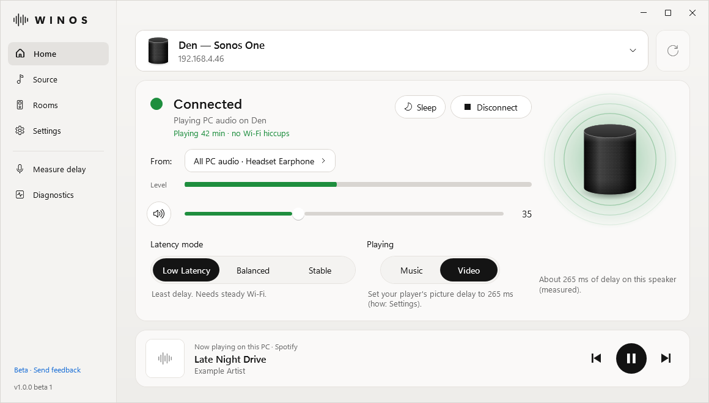

# WINOS

**Play your Windows PC's sound on your Sonos speakers** over your home Wi-Fi. Games, videos, Spotify and calls all work. No cables, no account, nothing in the cloud.

<picture>
  <source media="(prefers-color-scheme: dark)" srcset="images/winos-dark.png">
  
</picture>

## Try it free for 14 days

**[Download WINOS-Setup.exe](https://github.com/Kyberverse/winos/releases/latest/download/WINOS-Setup.exe)** (about 80 MB), or see the [latest release](https://github.com/Kyberverse/winos/releases/latest).

Every feature works during the trial. After 14 days, a one-time license key keeps WINOS working: **[buy a key](https://payhip.com/b/61oaS)**. No subscription.

- **Windows:** Windows 10 (version 2004 or newer) or Windows 11, 64-bit.
- **Speakers:** a Sonos speaker on the S2 app, on the same network as your PC.

## What it does

- **All PC audio, or just one app:** send everything, or only Spotify, a browser or a game.
- **Multi-room in sync:** play on several rooms at once, each with its own volume, and save groups.
- **Videos in sync:** WINOS measures your speaker's delay with any microphone, so you can set your video player to match.
- **Keyboard control:** your volume and mute keys control the Sonos while connected, plus shortcuts that work from any app.
- **Mini player, light and dark themes, starts with Windows** if you want, and built-in diagnostics.

## Install

1. Open `WINOS-Setup.exe`.
2. Windows shows "Windows protected your PC" because WINOS isn't code-signed yet. Click **More info**, then **Run anyway**.
3. Choose your options and click **Install**. It installs for your Windows account only, without administrator rights.
4. If Windows Firewall asks about WINOS, allow it on **Private networks**.
5. Pick your speaker and click **Connect**.

**Got a key?** Open WINOS › **Settings**, paste the key and click **Activate**. It works offline.

To uninstall: Windows Settings › Apps › Installed apps › WINOS › Uninstall.

To check the download is the real file, its SHA-256 checksum is listed in the release notes. In PowerShell, run `Get-FileHash .\WINOS-Setup.exe`.

## Help and feedback

- In WINOS, open **Diagnostics**: it checks your network, speakers and firewall and says what to fix. **Copy report** gives a summary with no passwords, keys or stream links.
- [Open an issue](https://github.com/Kyberverse/winos/issues/new/choose) and paste the report, or use the [feedback page](https://claude.ai/artifact/HdVNbU88pobrdVtLQ8HkqF), which builds the report for you.
- Bought a key and WINOS doesn't work with your setup? You can get a full refund within 14 days of buying.

## Privacy

Sound goes straight from your PC to your speakers over your local network. WINOS has no accounts, no tracking and no analytics. It only opens a web page when you click a link, such as Buy.

---

WINOS is an independent product. It is not affiliated with, endorsed, sponsored or approved by Sonos, Inc. Sonos is a trademark of Sonos, Inc. This repository hosts the WINOS installer; WINOS is not open source.
